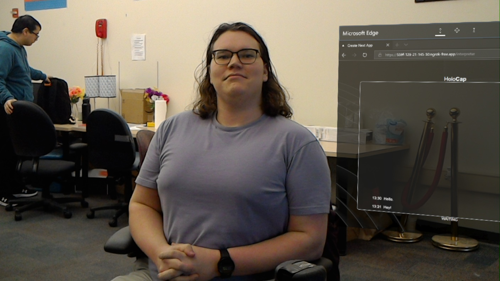

# HoloCap
**Objective**: This project is an attempt to help people with hearing disabilities and impairments utilizing the HoloLens that have the ability to auto-generate captions. It is especially helpful for situations where having an interpreter is difficult or is unavailable.


## Install and Run
Install the necessary dependencies:

`server/`
```
cd server
pip install openai-whisper ffmpeg
npm install express cors body-parser ws crypto
```

`nextapp/`
```
cd nextapp
npm i --force
```
**Note:** Force is required since ricky0123/vad conflicts with Next.JS

## Design
